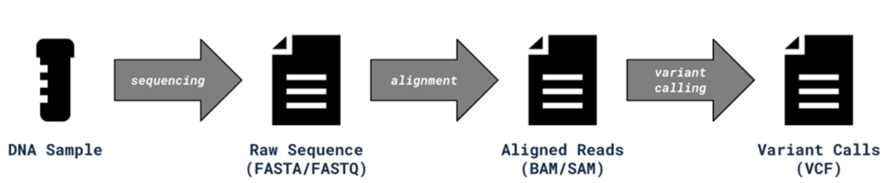

FluentVCF is a comprehensive, Bioconductor compliant, R package to
determine the mutation type for a set of single nucleotide variants in a
genome.

# Introduction

Variant Call Format (VCF) is a specification for storing genotype data
in a tab-delimited file format. Below is a high-level diagram of a
typical bioinformatics pipeline that produces a VCF file:

# Features

FluentVCF is a package which takes:

1.  a set of mutations (single nucleotide variants) in VCF format,
2.  the corresponding reference genome (e.g., human genome hg38) and
3.  a parameter “context_length” (see below) and determines for each
    mutation the corresponding mutation type as follows:
    
    The mutation type is “UP\[REF\>ALT\]DOWN” where:
    - “REF\>ALT” is the single nucleotide variant from REF base to ALT base, e.g., “C\>T” 
    - “UP” is upstream base from the reference genome (depending on the user parameter “context_length”) 
    - “DOWN” is one or more downstream bases from the reference genome (same user parameter)

The package provides an additional function, “mut_summary”, which
summarizes the mutation types for the set of mutations into a count
table (number of mutations per mutation type).

Moreover, graphical outputs are integrated.

# Requirements

The following packages are needed to run FluentVCF: VariantAnnotation,
GenomicRanges, dplyr, ggplot2, and RColorBrewer.
